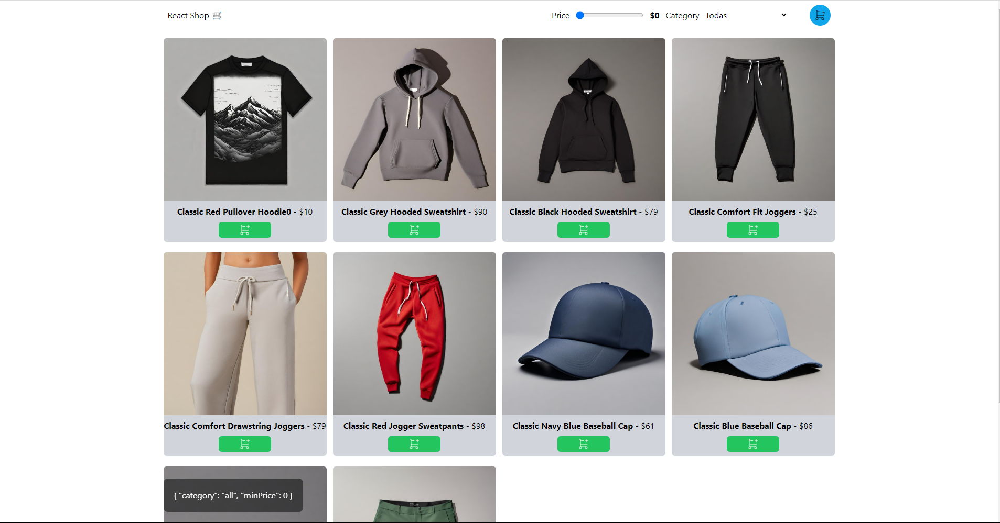
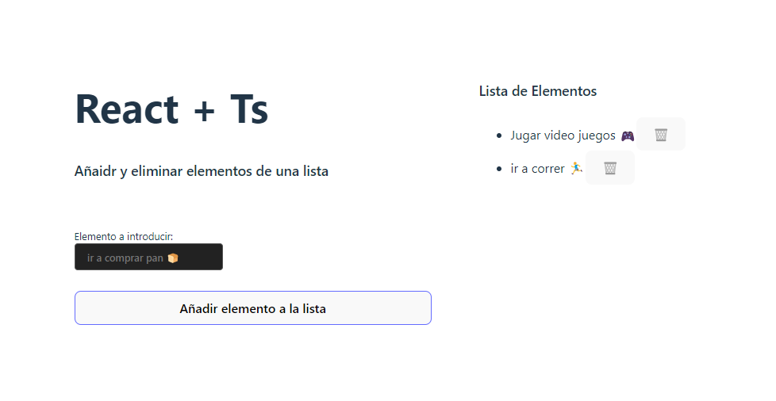

1. Shopping Cart

- Link: https://github.com/clix002/practicas-reactjs/tree/main/shopping-card

2. Añadir y eliminar elementos de una lista (React +Ts) 

- Link: https://github.com/clix002/practicas-reactjs/tree/main/lc-add-items-react-ts
